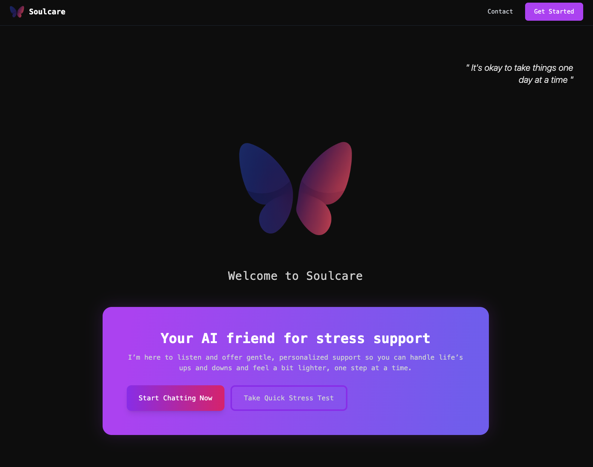
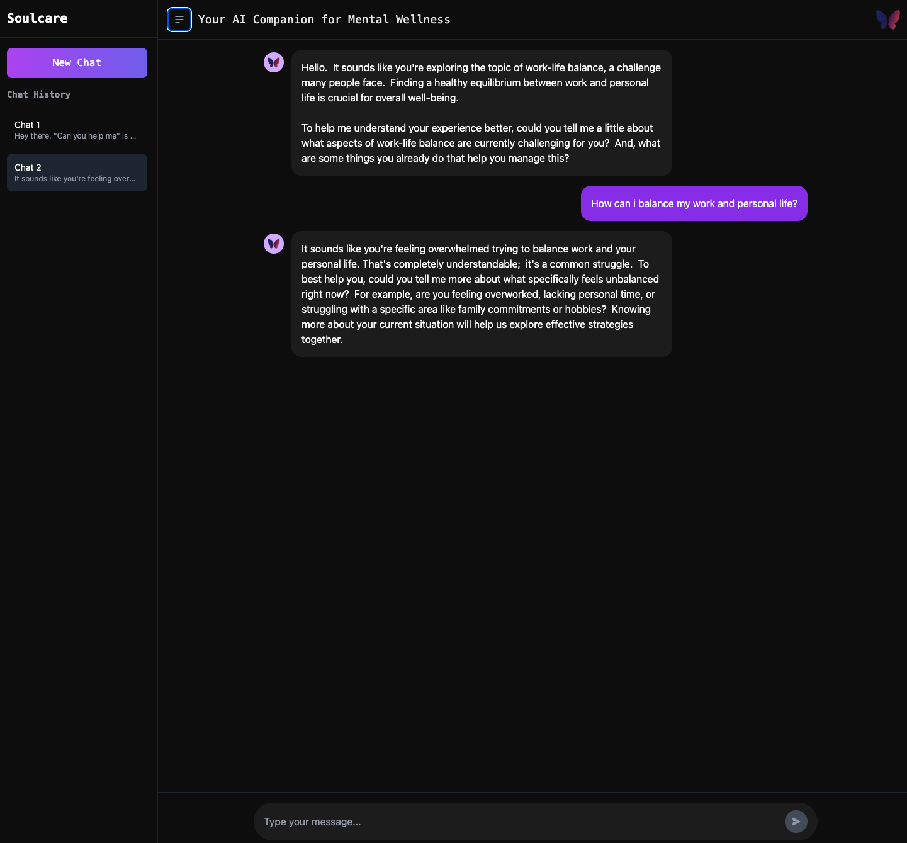
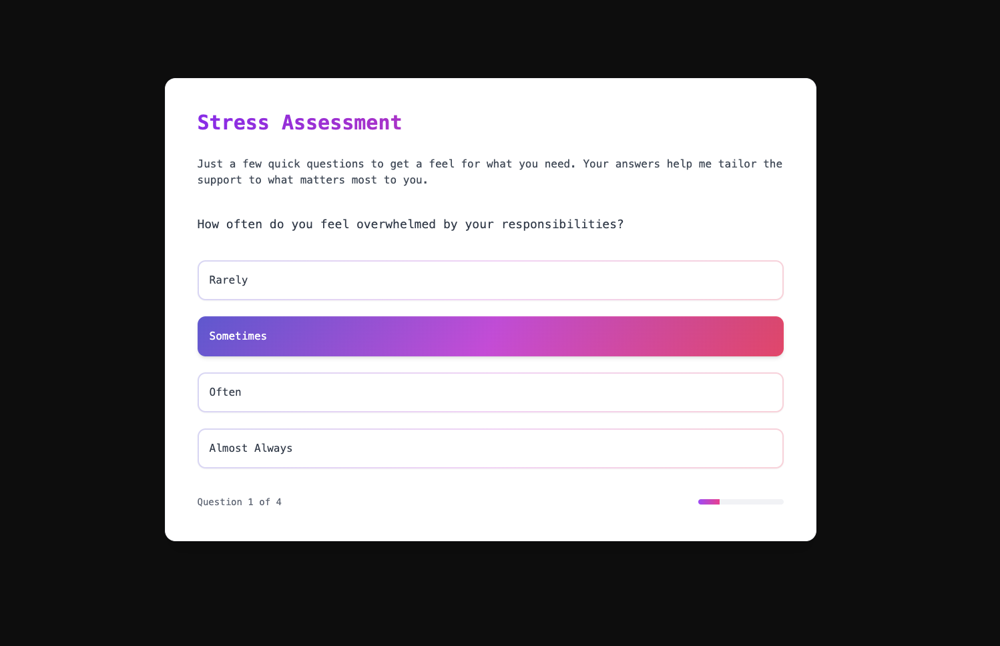
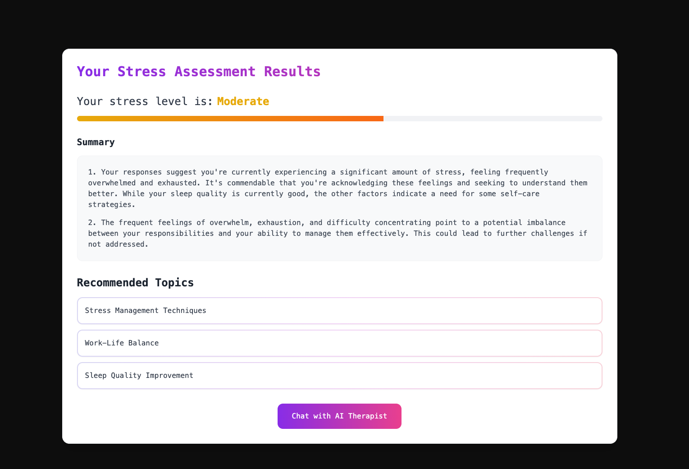

# Soulcare - AI Mental Wellness Companion

A modern web application providing personalized mental wellness support through AI-powered conversations and stress assessment.

<div align="center">
  
</div>

## Features

- 🤖 Real-time AI therapeutic conversations using Google's Gemini AI
- 📊 Interactive stress assessment with personalized analysis
- 💬 Persistent chat history with conversation management
- 🎨 Sleek, responsive UI with smooth animations
- 📱 Mobile-first design with intuitive interactions
- 🔒 Rate limiting and usage tracking for API calls

<div align="center">
  
</div>
<div align="center">
  
</div>
<div align="center">
  
</div>
<div align="center">
  
</div>

## Tech Stack

### Frontend
- **Framework**: React 18 with TypeScript
- **Build Tool**: Vite
- **Styling**: TailwindCSS with custom animations
- **State Management**: React Hooks and Context
- **Animations**: Framer Motion
- **Icons**: React Icons

### APIs & Backend Integration
- **AI Model**: Google Gemini AI
- **API Integration**: Custom proxy implementation
- **Data Persistence**: Local Storage with TypeScript types

### Key Libraries
- `framer-motion` - For smooth animations and transitions
- `react-router-dom` - For seamless navigation
- `@google/generative-ai` - For AI conversation capabilities
- `tailwindcss` - For utility-first styling

## Main Features

### AI Chatbot
- Real-time conversation with AI therapist
- Context-aware responses
- Chat history management
- Daily usage limiting

### Stress Assessment
- Interactive questionnaire
- AI-powered analysis
- Personalized recommendations
- Visual result representation

### User Interface
- Responsive design for all devices
- Animated transitions
- Dark mode optimized
- Mobile-friendly input handling

## Future Enhancements

- User authentication
- Cloud data persistence
- Voice interaction
- More assessment types
- Advanced analytics

## Getting Started

```bash
# Clone the repository
git clone https://github.com/yourusername/soulcare.git

# Install dependencies
cd soulcare
pnpm install

# Start development server
pnpm run dev
```

## Environment Variables

```env
VITE_GEMINI_PROXY_URL=your_api_url
```

## Setting Up Gemini API Proxy

For security reasons, this project uses a proxy server to handle Gemini API interactions. Here's how to set it up:

### 1. Get Gemini API Key
- Visit [Google AI Studio](https://makersuite.google.com/app/apikey)
- Create a new API key

### 2. Create Proxy Server
You can use this simple Node.js/Express server template and deploy it to Vercel:

```typescript
import { GoogleGenerativeAI } from "@google/generative-ai";

const genAI = new GoogleGenerativeAI(process.env.GEMINI_API_KEY);

export default async function handler(req, res) {
  if (req.method !== "POST") return res.status(405).end();

  try {
    const model = genAI.getGenerativeModel({ model: "gemini-1.5-flash" });
    const result = await model.generateContent(req.body.prompt);
    return res.status(200).json({ text: result.response.text() });
  } catch (error) {
    return res.status(500).json({ error: error.message });
  }
}
```

### 3. Deploy to Vercel
- Push your proxy server code to GitHub
- Import the repository in Vercel
- Add `GEMINI_API_KEY` to Environment Variables in Vercel
- Deploy and copy your deployment URL

### 4. Configure Frontend
Add your proxy server URL to `.env`:
```env
VITE_GEMINI_PROXY_URL=https://your-vercel-deployment-url.vercel.app
```

### Security Notes
- ✅ API keys are stored securely in Vercel
- ✅ CORS is handled automatically
- ✅ Rate limiting implemented in frontend
- ⚠️ Add additional security measures for production

---

Built with 💜 by Kumush
